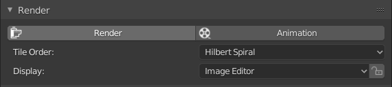

# Blender 2.8x-RenderButton
Adds a simple render and animation button as well as display settings for Blender 2.8x.

works with Blender >= v2.80

This is a fork of https://github.com/Mitsuma/Blender2.8-RenderButton
# Preview:

It gets added at the bottom of the Render Properties windows, just move it up and save over the startup file to always have it up at the beginning.

# Installation:
- Download the AddRenderButton.py from [release page](https://github.com/zocker-160/Blender2.8-RenderButton/releases)
- Open the Blender Preferences (Edit - Preferences...) and click "Install Add-on from File..."
- Select the AddRenderButton.py
- Save Preferences
- Done ;)

# Contributions
Thanks to [Mitsuma](https://github.com/Mitsuma) for the initial idea and version!

# Disclaimer
**This is a quick hackjob, should not cause any issue but use on your own risk.**  
Removing/Adding the addon does not seem to cause any issues.  
If you open older files with it enabled, the panel will be at the bottom again!  

Not sure about licenses and stuff but feel free to edit/improve/share it as you like.  
Its not like this is some mega complex script or anything.
Code is mostly just transferred from Blender 2.79.
